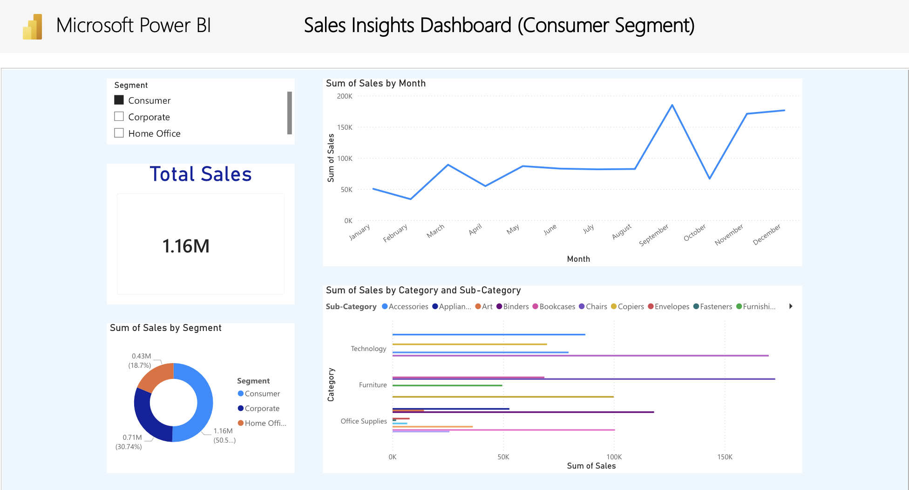
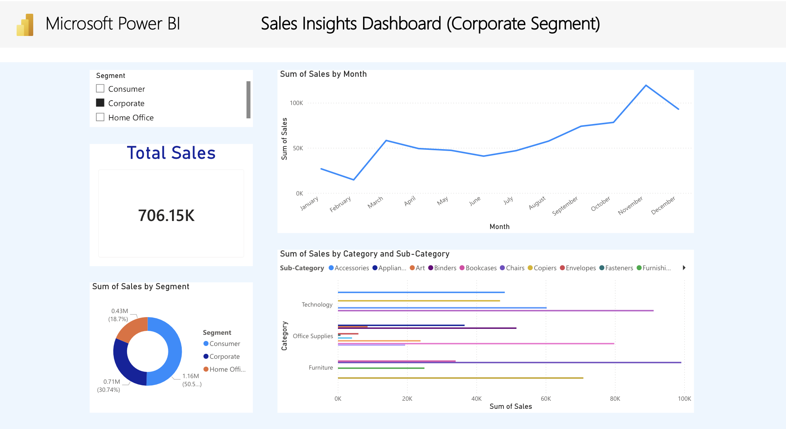
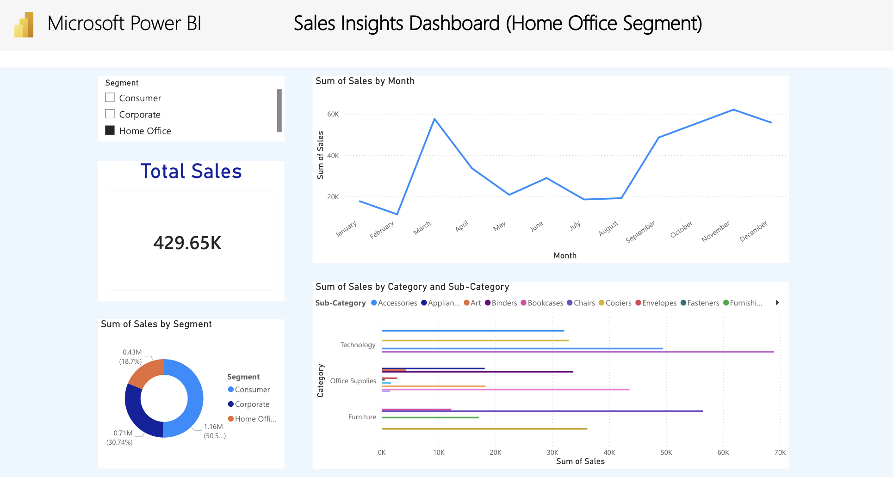

# Power BI Sales Insights Dashboard

Interactive Power BI dashboard showcasing sales trends, segmentation, and category-level insights.

## Dashboard Views by Segment

### Consumer Segment

Shows total sales performance and monthly trends for individual customers, highlighting strong seasonality and peak sales periods driven by consumer demand.

### Corporate Segment

Analyzes sales trends for corporate clients, focusing on stable revenue patterns and category-level performance across business-oriented purchases.

### Home Office Segment

Provides insights into the home office segment, emphasizing smaller-scale but consistent sales driven by remote work and office supply demand.
